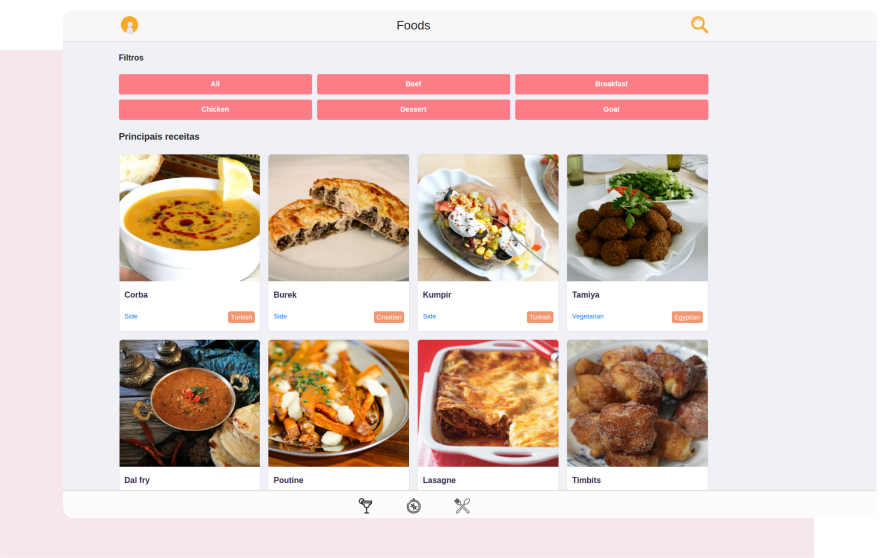

# Recipes App
  
## Objetivo: 
O objetivo deste projeto foi criar uma aplicação completa, um app de receitas, com ele o usuário pode visualizar receitas de comidas e bebidas, favoritar, inciar uma receita, perfil do usuário entre outras ações.

## Contém:
Neste projeto pude práticar e aprimorar meus conhecimentos em:
- **HTML5**;
- **CSS3**;
- **ReactJs**;
- **Context Api**;

# Habilidades: 

Neste projeto, foi verificado a capacidade de:

* Utilizar Redux para gerenciar estado.

* Utilizar a biblioteca React-Redux.

* Utilizar a Context API do React para gerenciar estado.

* Utilizar o React Hook useState.

* Utilizar o React Hook useContext.

* Utilizar o React Hook useEffect.

* Criar Hooks customizados.

* Trabalhar em equipe.

* Ultilizar a framework Scrum Master para gerenciamento de projetos.

## Bibliotecas que contém neste projeto:
* **[ReactJS](https://pt-br.reactjs.org/)**
* **[Redux](https://redux.js.org/)**
* **[Scrum Master](https://g.co/kgs/NoFQZW)**

## Layout:

